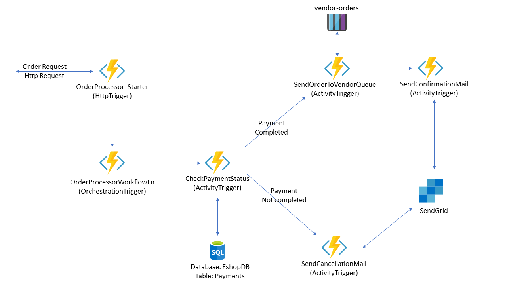
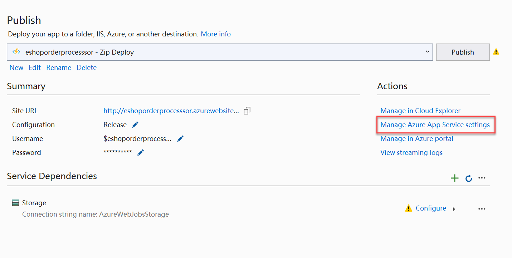
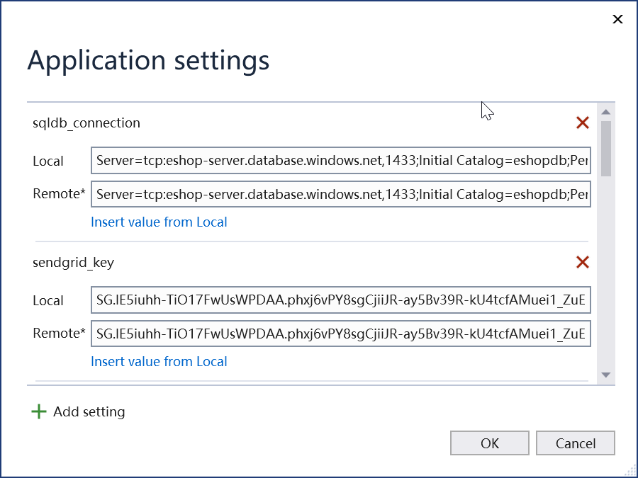

# Azure Durable Functions Tutorial

## Order Processing Workflow



This tutorials demonstrates how to create a Azure Durable functions to create an order processing workflow for confirming the order details placed by an e-commerce application and send confirmation or cancellation mail to the customer according to the status of the payment. Orchestrator function calls the `CheckPaymentStatus` activity function to check the payment status. If payment status is `Completed`, the orchestrator function calls a `SendOrderToVendorQueue` to send the order details to the vendors queue in a storage account. After the order details are sent to the `vendor-orders` queue the workflow executes a `SendConfirmationMail` activity function to send an order confirmation mail to the customer. If the payment status is not `Completed` the `SendCancellationMail` function will be executed and it send a mail to the customer indicating the cancellation of order due to payment failure. 

In this tutorial we are using `Azure SQL database`, `SendGrid` and `Storage account Queue` services for the execution of the workflow.

### Prerequisites
* Azure Subscription
* .NET Core 3.1 SDK
* Visual Studio 2019 (Azure Development must be enabled during installation)
* Postman (REST api testing tool)
* SQL Server Management Studio 

## Preparing the Azure Services
### Create and configure Azure SQL Database
1) Open Azure Portal by navigating to [https://portal.azure.com](https://portal.azure.com) and login to the Azure account.
2) Create a new resource group with the name `AzureFunctionsGroup`.
3) Create an `SQL Database` service instance by selecting `Create a resource > Databases > SQL Database`. 
4) Provide the following values to create the database and logical server.
        
    |Parameter          | Value                       |
    |-------------------|-----------------------------|
    |Basic              |                             |
    |Resource Group     | AzureFunctionsGroup         |
    |Location           | East US                     |
    |Database name      | eshopdb                     |
    |Server Name        | eshop-server                |
    |Admin user         | labuser                     |
    |Password           | Password@123                |
    |Compute + Stroage  | General Purpose (Serverless)|
    |Networking         |                             |
    |Connectivity Method| Public endpoint             |
    |Allow Azure services and resources to access this server              | Yes                         |
    |Add current client IP address| Yes               |
    |Additional Settings                              |
    |Use existing data  | None                        |
    |Collation          | Do not modify. Leave the default value|

5) After the database server is created, go to the overview page and copy the `Server name` value. Open `SQL Server Management Studio` and connect using the Server name you have copied and the admin user name and password which you have used at the time of creating service.
6) Open a new query window in `SQL Server Management Studio` and run the following query to create the payments table.
    ```
    USE eshopdb
    GO
    
    CREATE TABLE [dbo].[Payments](
    	[Id] [int] IDENTITY(1,1) NOT NULL,
    	[OrderId] [int] NOT NULL,
    	[PaymentMode] [varchar](25) NOT NULL,
    	[Amount] [numeric](10, 2) NOT NULL,
    	[PaymentStatus] [varchar](20) NOT NULL,
     CONSTRAINT [PK_Payments] PRIMARY KEY CLUSTERED 
    (
    	[Id] ASC
    )WITH (STATISTICS_NORECOMPUTE = OFF, IGNORE_DUP_KEY = OFF) ON [PRIMARY]
    ) ON [PRIMARY]
    GO    
    ``` 
7) After the `Payments` table is created run the following queries to insert some sample records in to the table.
    ```
    INSERT INTO [dbo].[Payments] VALUES ( 101, 'Cash', 5000, 'Completed')
    INSERT INTO [dbo].[Payments] VALUES ( 102, 'Cash', 12300, 'Completed')
    INSERT INTO [dbo].[Payments] VALUES ( 103, 'CC', 7600, 'Pending')
    INSERT INTO [dbo].[Payments] VALUES ( 104, 'DC', 3200, 'Completed')
    INSERT INTO [dbo].[Payments] VALUES ( 105, 'Online', 4300, 'Pending')
    GO
    ```
8) Go to Azure Portal and copy the database connection string from the `Connection Strings` section of your database service and save into a text file. We will be using this while creating the Durable function. Replace `{your_password}` with the password value you have used while creating the Database instance.

### Create and configure the storage account queue
1) Open Azure Portal and create a new storge account service by choosing `Create a resource > Storage > Storage account`.
2) Provide the following values to create the storage account.
    
    |Parameter              |Value                       |
    |-----------------------|----------------------------|
    |Resource group         | AzureFunctionsGroup        |
    |Storage account name   | eshopstorage               |
    |Location               | East US                    |
    |Performance            | Standard                   |
    |Account Kind           | Storage V2                 |
    |Replication            | LRS                        |
    |Access Tier            | Hot                        |
    |Connectivity Method    | Public endpoint            |
    
3) Once the storage account is created, open the storage account and navigate to the Queues section. 
4) Click on `+ Queue` to create a new queue. Provide the queue name as `vendor-orders` and click OK.

### Create and configure SendGrid account
1) Open Azure Portal and click on `Create a resource`.
2) Search for `SendGrid` and click on `Create` to create a new `SendGrid` service.
3) Provide the following values to create the account
    |Parameter              |Value                       |
    |-----------------------|----------------------------|
    |Resource group         | AzureFunctionsGroup        |    
    |Location               | East US                    |
    |Name                   | EshopSendgrid              |
    |Password               | Password@123               |
    |Pricing Tier           | Free                       |
    |First name             | &lt;Your first name&gt;    |
    |Last name              | &lt;Your last name&gt;     |
    |Email                  | &lt;Your email id&gt;      |
    |Company                | &lt;Your company name&gt;  |
    |Website                | &lt;Your company website&gt;|

4) Once the SendGrid account is created, Click on the `Manage` button from the overview page. This will open the SendGrid account console page in new tab.  
5) On the left pane, select `Settings` and click on the `API Keys` to create a new API key for your application.
6) Click in the `Create API Key` button and provide a name for the API key. Choose `Full Access` from the `API Key Permissions` list and click on `Create and View`.
7) Copy the API key in to a text file which we need to configure in out Durable functions application.

### Create Azure Functions App 
1) Open Azure Portal and click on `create a resource ` and search for `Function App`. From the list choose `Function App` and click Create.
2) Provide the following details to create Function App:
    |Parameter              |Value                       |
    |-----------------------|----------------------------|
    |Resource group         | AzureFunctionsGroup        |    
    |Region                 | East US                    |
    |Name                   | eshoporderprocesssor       |
    |Publish                | Code                       |
    |Runtime stack          | .NET Core                  |
    |Version                | 3.1                        |
    |Hosting                |                            |
    |Storage account        | Select the storage account created above |
    |Operating System       | Windows                    |
    |Plan                   | Consumption Plan           |

3) Click on create to create the Function App.

## Create OrderProcessing Workflow using Function App
1) Open Visual Studio 2019 and select `Azure Functions` template to create a Azure Functions app project. Specify the Project name as `OrderProcessingWorkflow` and select a project location.
2) In the Trigger selection page, choose `Empty` and select Functions runtime as `Azure Functions V3`. You can also select `Storage Emulator` as the storage account value.
3) Once the project is created, open the solution explorer and right click on the project and choose `Add > New Azure Function`. In the dialog box, specify the function name as `OrderProcessingFn` and click Add.
4) From the Trigger selection dialog box choose `Durable Functions Orchestration` and click OK.
5) The function will be generated with some default code. You can remove all the methods from the `OrderProcessingFn` class.
6) In this tutorial, we are going to process and order reqeust sent from the e-commerce application. The application will send an Http POST reqeust with the order data to start the workflow. We need to create a model class to store the order informations. Create a new folder `Models` and add a new class file in to the folder. Name the class file as `Order.cs`.  Add the following code to the `Order.cs` file.
    ```
    using Newtonsoft.Json;
    using System;
    using System.Collections.Generic;
    using System.Text;
    
    namespace OrderProcessingWorkflow.Models
    {        
        public class Order
        {
            [JsonProperty("id")]        
            public int Id { get; set; }
    
            [JsonProperty("customerName")]        
            public string CustomerName { get; set; }
    
            [JsonProperty("amount")]        
            public double Amount { get; set; }
    
            [JsonProperty("orderDate")]        
            public DateTime OrderDate { get; set; }
    
            [JsonProperty("deliveryDate")]        
            public DateTime DeliveryDate { get; set; }
    
            [JsonProperty("email")]      
            public string Email { get; set; }
        }
    }
    
    ```
7) Now, we are creating our Durable functions starter method. The starter method will be an `HttpTrigger` function. Copy the below code to the `OrderProcessingFn` class.
    ```
    [FunctionName("OrderProcessor_Starter")]
    public static async Task<HttpResponseMessage> HttpStart(
        [HttpTrigger(AuthorizationLevel.Anonymous, "get", "post")] HttpRequestMessage req,
            [DurableClient] IDurableOrchestrationClient starter,
            ILogger log)
    {
        Order order = await req.Content.ReadAsAsync<Order>();
        string instanceId = await starter.StartNewAsync<Order>("OrderProcessorWorkflowFn", order);
        log.LogInformation($"Started orchestration with ID = '{instanceId}'.");
        return starter.CreateCheckStatusResponse(req, instanceId);
    }  
    ```
8) Add an Durable function orchestrator method to the class. Copy the below code below the Starter method.
    ```
    [FunctionName("OrderProcessorWorkflowFn")]
    public static async Task<string> RunOrchestrator([OrchestrationTrigger] IDurableOrchestrationContext context)
    {
        // Will update the method soon
    }
    ```
9) Next, we need to create and activity function `CheckPaymentStatus` that checks the payment status of the current order received in the starter method. It uses the `payments` table in the `eshopdb` batabase. To connect to the SQL database install the `System.Data.SqlClient` nuget package by running the following command.
    > Install-Package System.Data.SqlClient -Version 4.8.1
10) Open the `local.settings.json` file and add a new setting that provides the connection string value for the `Azure SQL database`. Add a new setting with the key `sqldb_connection` and the value as the the connection string you have copied and stored in the text file.
11) Import the namespace `System.Data.SqlClient` to the `OrderProcessingFn` class and copy the following code below the orchestrator function.
    ```
    [FunctionName("CheckPaymentStatus")]
    public static async Task<bool> CheckPaymentStatus([ActivityTrigger] int orderId, ILogger log)
    {
        var str = Environment.GetEnvironmentVariable("sqldb_connection");
        using (SqlConnection connection = new SqlConnection(str))
        {
            connection.Open();
            var sql = $"select PaymentStatus from Payments where OrderId={orderId}";
            using (SqlCommand command = connection.CreateCommand())
            {
                command.CommandText = sql;
                object status = await command.ExecuteScalarAsync();
                if (status != null)
                {
                    string statusText = status.ToString();
                    if (statusText == "Completed") return true;
                    else return false;
                }
                else
                {
                    return false;
                }
            }
        }
    }

    ```
12) Inside the Orchestrator method add the following code that calls the `CheckPaymentStatus` activity function and returns true if payment is completed and false if not completed. If payment is completed we will add the order details to the `vendor-orders` queue and send a confirmation mail to the customer. If payment is not completed we will send a cancellation mail to the customer. We can read the order object from the `context` object using the `GetInput()` method. 
    ```
    Order order = context.GetInput<Order>();
    var paymentCompleted = await context.CallActivityAsync<bool>("CheckPaymentStatus", order.Id);
    if (paymentCompleted)
    {
        // Send order to vendor-orders queue
        // Send confirmation mail to customer
    }
    else
    {
        // Send cancellation mail to customer
    }
    ```
13) To send the order details to the `vendor-details` queue in the storage account you need to install the `Microsoft.Azure.WebJobs.Extensions.Storage` nuget package to the application. Add the following code below the `CheckPaymentStatus` activity function. 
    ```
    [FunctionName("SendOrderToVendorQueue")]
    [return: Queue("vendor-orders", Connection = "AzureWebJobsStorage")]
    public static string SendOrderToVendorQueue([ActivityTrigger] Order order, ILogger log)
    {
        return JsonConvert.SerializeObject(order);
    }
    ```
    > [!TIP]
    > Import the `Newtonsoft.Json` naemspace in the import section to use the JsonConvert class.

    > [!NOTE]
    > We assume that the `vendor-orders` queue is created in the default storage account for the Azure function. If you are using a different storage account, you need to create a key-value pair in `local.settings.json` file with the connection string name and value.
14) After the order is sent to the `vendor-orders` queue, you need to send a confirmation mail to customer. To send the mail from the application, we can use the `SendGrid` service. Install the `Microsoft.Azure.WebJobs.Extensions.SendGrid` nuget package to the application. Open `local.settings.json` file and add a new setting with the key `sendgrid_key` and the sendgrid key which you have copied in text file as the value.
    ```
    "sendgrid_key": "<YOUR_SENDGRID_SERVICE_KEY_HERE"
    ```
15) Add the following code below the `SendOrderToVendorQueue` function. This will add the `SendConfirmationMail` and `SendCancellationMail` functions to the class.
    ```
    [FunctionName("SendConfirmationMail")]
    public static async Task<bool> SendConfirmationMail([ActivityTrigger] Order order, ILogger log)
    {
        try
        {
            var authKey = Environment.GetEnvironmentVariable("sendgrid_key");
            SendGridClient client = new SendGridClient(authKey);

            var from = new EmailAddress("sonusathyadas@hotmail.com", "byteSTREAM Admin");
            var subject = $"Your Order confirmed with order Id {order.Id}";
            var to = new EmailAddress(order.Email, order.CustomerName);
            var htmlContent = $"Hi {order.CustomerName},<br/>" +
                $"Your order with Id {order.Id} for Rs {order.Amount}/- is confirmed by the seller. Your order will be " +
                $"delivered on {order.DeliveryDate.ToShortDateString()}. ";
            var message = MailHelper.CreateSingleEmail(from, to, subject, "", htmlContent);
            var response = await client.SendEmailAsync(message);
            return true;
        }
        catch (Exception ex)
        {
            log.LogInformation(ex.Message);
            return false;
        }
    }

    [FunctionName("SendCancellationMail")]
    public static async Task<bool> SendCancellationMail([ActivityTrigger] Order order, ILogger log)
    {
        try
        {
            var authKey = Environment.GetEnvironmentVariable("sendgrid_key");
            SendGridClient client = new SendGridClient(authKey);

            var from = new EmailAddress("sonusathyadas@hotmail.com", "byteSTREAM Admin");
            var subject = $"Order cancelled. Order Id: {order.Id}";
            var to = new EmailAddress(order.Email, order.CustomerName);
            var htmlContent = $"Hi {order.CustomerName},<br/>" +
                $"Your order with Id {order.Id} for Rs {order.Amount}/- is cancelled because the payment is " +
                $"not completed. You can try to place the order after sometime.";
            var message = MailHelper.CreateSingleEmail(from, to, subject, "", htmlContent);
            var response = await client.SendEmailAsync(message);

            return true;
        }
        catch (Exception ex)
        {
            log.LogInformation(ex.Message);
            return false;
        }
    }
    ```

16) Update the Orchestrator function to call the newly created activity methods
    ```
    [FunctionName("OrderProcessorWorkflowFn")]
    public static async Task<string> RunOrchestrator([OrchestrationTrigger] IDurableOrchestrationContext context)
    {
        Order order = context.GetInput<Order>();
        var paymentCompleted = await context.CallActivityAsync<bool>("CheckPaymentStatus", order.Id);
        if (paymentCompleted)
        {
            await context.CallActivityAsync("SendOrderToVendorQueue", order);
            await context.CallActivityAsync<bool>("SendConfirmationMail", order);
            return $"Order confirmation mail sent to {order.Email}";
        }
        else
        {
            await context.CallActivityAsync<bool>("SendCancellationMail", order);
            return $"Order is not completed. Cancellation mail sent to {order.Email}";
        }
    }
    ```
17) Press F5 to run and test the function locally. 
    > [!TIP]
    > While running locally, you will be using your storage emulator to store the messages in the queue. Ensure the `vendor-queues` queue is created in the storage emulator.

### Publish the application to Azure Function App
1) To publish the application to Azure Function App, right click on the project and select `Publish`.
2) In the publish window, select `Azure > Azure Function App (Windows)` and click Next.
3) Choose the Azure subscription, Resource group and the Function app which you have created previously. Click Finish.
4) In the Publish window, click on `Manage Azure App Service Settings` link.
    
5) In the dialog box you can see the list of app service settings with local and remote values. Find the keys `sqldb_connection` and `sendgrid_key` and click on the `Insert value from Local` button to copy the values from local to remote. Click OK.
    
6) Click on the publish button to publish the application to Azure Function App.

